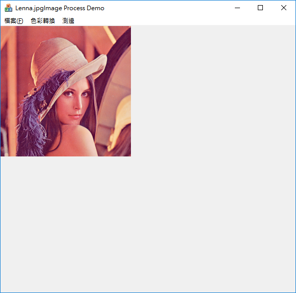
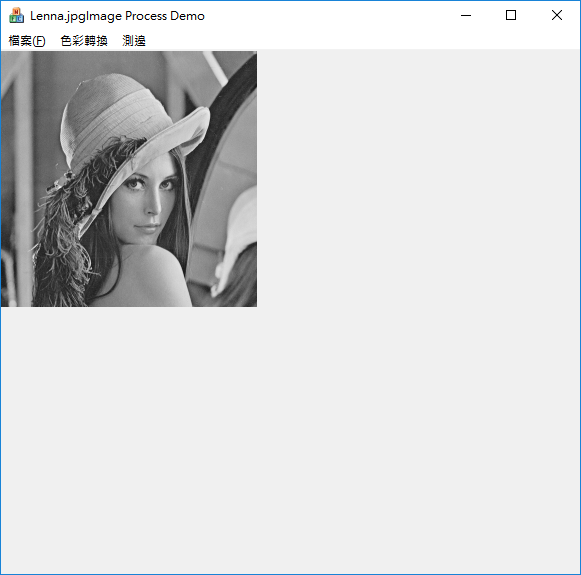
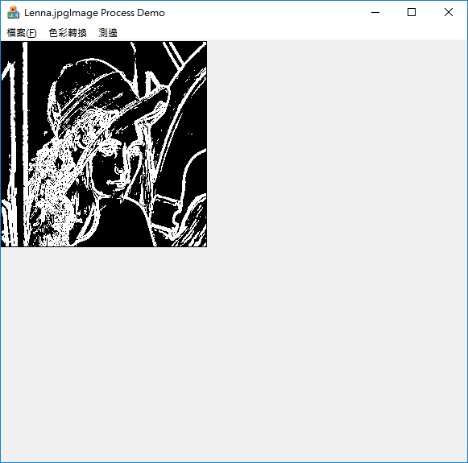

# ImageProcessMFC
A sample program for image processing in Visual Studio 2017

Scrennshot1: Open a color image file.

Screenshot2: Convert the color image into gray level image.

Screenshot3: Detect the edges on the image.

